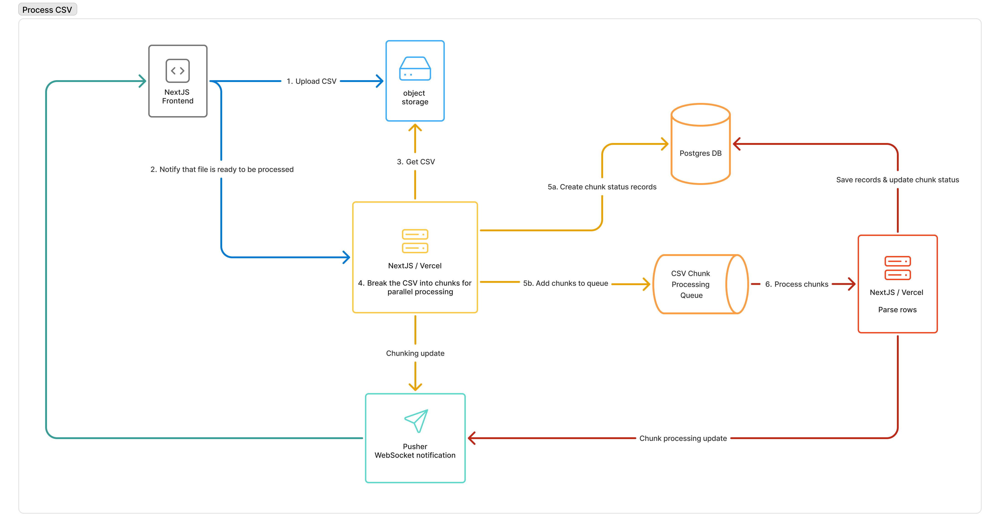

# Dex

A contact management system built to upload and process CSV files with over 1 million rows.

Try it out at [https://cms-five-pearl.vercel.app](https://cms-five-pearl.vercel.app/)

## Goals

- [x] System should be scalable (ideally serverless)
- [x] The user should be able to upload CSV files with many rows (1M+)
- [x] The user should be able to see the progress of the file upload in real time

## Architecture

### Tools

- [Drizzle](https://orm.drizzle.team/docs/overview) - ORM
- [Next.js](https://nextjs.org/docs) - Frontend & backend
- [Vercel](https://vercel.com/docs) - NextJS Hosting & [Fluid Compute](https://vercel.com/fluid)
- [Upstash Qstash](https://upstash.com/docs/qstash) - Queue service
- [Pusher](https://pusher.com/docs) - Realtime updates with websockets
- [Cloudflare R2](https://developers.cloudflare.com/r2/) - Object storage
- [AWS Aurora Serverless Postgres](https://aws.amazon.com/rds/aurora/?nc2=h_ql_prod_db_aa) - Database

### Architecture
First, the user uploads a CSV file to the system using a presigned URL.


Then, the system will process the file in chunks and save the data to the database. Note: Step 1 is outlined in more detail in the previous image.



## Local Development

> Note: Make sure you have all the environment variables set up in your `.env` file. Without them, the app won't run.

We use concurrently to run NextJS and the queue server with one command:

```bash
npm run dev
```

If you need to run the queue server separately, you can use the following command:

```bash
npx @upstash/qstash-cli dev
```

You can use docker to run the database locally:

```bash
docker pull postgres

docker run -d \
 --name dex \
 -e POSTGRES_PASSWORD=postgres \
 -e POSTGRES_USER=postgres \
 -e POSTGRES_DB=dex \
 -e POSTGRES_HOST_AUTH_METHOD=scram-sha-256 \
 -e POSTGRES_INITDB_ARGS="--auth-host=scram-sha-256" \
 -p 5432:5432 \
 postgres
```
