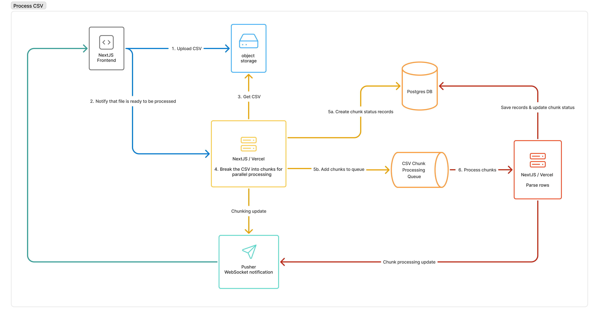

# Dex

A contact management system built to upload and process CSV files with over 1 million rows.

Try it out at [https://cms-five-pearl.vercel.app](https://cms-five-pearl.vercel.app/)

https://github.com/user-attachments/assets/48028a32-a88d-4a65-b6d6-aaa3849ecde0

## Goals

- [x] System should be scalable (ideally serverless)
- [x] The user should be able to upload CSV files with 1 million rows
- [x] The user should be able to see the progress of the file upload in real time

## Tools

- [Next.js](https://nextjs.org/docs) - Frontend & backend
- [Drizzle](https://orm.drizzle.team/docs/overview) - ORM
- [tRPC](https://trpc.io/docs) - RPC wrapper around Tanstack Query
- [Vercel](https://vercel.com/docs) - NextJS Hosting & [Fluid Compute](https://vercel.com/fluid)
- [Upstash Qstash](https://upstash.com/docs/qstash) - Queue service
- [Pusher](https://pusher.com/docs) - Realtime updates with websockets
- [Cloudflare R2](https://developers.cloudflare.com/r2/) - Object storage
- [AWS Aurora Serverless Postgres](https://aws.amazon.com/rds/aurora/?nc2=h_ql_prod_db_aa) - Database

## System Design



1. The user uploads a CSV file using a [presigned URL](https://developers.cloudflare.com/r2/api/s3/presigned-urls/).
2. The frontend notifies the backend when the file is uploaded and ready to be processed.
3. The backend streams in the file from R2.
4. As the file is streamed in, it is broken down into chunks.
5. We create a record in the database for each chunk to track it's progress and add the chunk to a queue.
6. The queue pushes chunks to a serverless function to process parse the chunk and save it's data to the database.

## Local Development

### Installation

```bash
npm install
```

### Running the app

> Note: Make sure you have all the environment variables set up in your `.env` file. Without them, the app won't run.

We use concurrently to run NextJS and the queue server with one command:

```bash
npm run dev
```

If you need to run the queue server separately, you can use the following command:

```bash
npx @upstash/qstash-cli dev
```

### Local Database

You can use docker to run the database locally:

```bash
docker pull postgres

docker run -d \
 --name dex \
 -e POSTGRES_PASSWORD=postgres \
 -e POSTGRES_USER=postgres \
 -e POSTGRES_DB=dex \
 -e POSTGRES_HOST_AUTH_METHOD=scram-sha-256 \
 -e POSTGRES_INITDB_ARGS="--auth-host=scram-sha-256" \
 -p 5432:5432 \
 postgres
```

After updating the schema, we can push the changes to the database with the following command:

```bash
npm run db:push
```

## Updating Production

Since we are using Vercel, we can just push to the main branch and it will automatically deploy to production.
